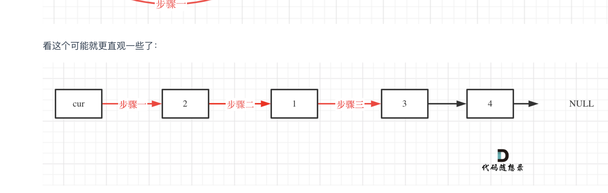

# 24.两两交换链表中的节点

[力扣题目链接](https://leetcode.cn/problems/swap-nodes-in-pairs/)

解题思路：https://programmercarl.com/algo/other/0024-swap-nodes-in-pairs.html#%E7%AE%97%E6%B3%95%E5%85%AC%E5%BC%80%E8%AF%BE

## 题解 -- 基于虚拟头节点



对应的C++代码实现如下： （注释中详细和如上图中的三步做对应）

```cpp
class Solution {
public:
    ListNode* swapPairs(ListNode* head) {
        ListNode* dummyHead = new ListNode(0); // 设置一个虚拟头结点
        dummyHead->next = head; // 将虚拟头结点指向head，这样方便后面做删除操作
        ListNode* cur = dummyHead;
        while(cur->next != nullptr && cur->next->next != nullptr) {
            ListNode* tmp = cur->next; // 记录临时节点
            ListNode* tmp1 = cur->next->next->next; // 记录临时节点

            cur->next = cur->next->next;    // 步骤一
            cur->next->next = tmp;          // 步骤二
            cur->next->next->next = tmp1;   // 步骤三

            cur = cur->next->next; // cur移动两位，准备下一轮交换
        }
        ListNode* result = dummyHead->next;
        delete dummyHead;
        return result;
    }
};
```

- 时间复杂度：O(n)
- 空间复杂度：O(1)

